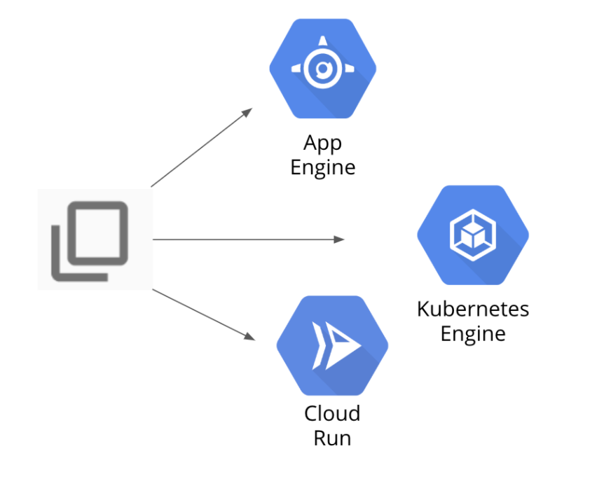

# DevOps Pipeline Google Cloud 

Deploy applications to the Google Cloud services App Engine, Kubernetes Engine, and Cloud Run.



## Download a app from GitHub


Activate Cloud Shell 

``` shell
mkdir gcp-course
cd gcp-course
git clone https://GitHub.com/GoogleCloudPlatform/training-data-analyst.git
cd training-data-analyst/courses/design-process/deploying-apps-to-gcp
sudo pip3 install -r requirements.txt
python3 main.py
```

Go to Web Preview, on port 8080

## Deploy to App Engine

Create new file app.yaml


``` shell
cd gcp-course/training-data-analyst/courses/design-process/deploying-apps-to-gcp
echo "runtime: python37" > app.yaml
```

App Engine application has to be created

``` shell
gcloud app create --region=us-central
gcloud app deploy --version=one --quiet
```

Navigation menu, click App Engine > Dashboard. In the upper-right corner of the dashboard is a link to your application.

Click on the link to test your program. Make a change to the program to see how easy the App Engine makes managing versions.


Edit file main.py

``` shell
cd training-data-analyst/courses/design-process/deploying-apps-to-gcp
```

``` python
 model = {"title": "Hello App Engine."}
 ```

Now deploy version two

``` shell
gcloud app deploy --version=two --no-promote --quiet
```

You should see again " Hello GCP ". This is because of the --no-promote parameter in the previous command.

Go to the Versions tab. Notice that two versions are listed.

Click on the version two link to test it. It should return "Hello App Engine".

To migrate production traffic to version two, click Split Traffic at the top. Change the version to two, and click Save. Give it a minute to complete. Refresh the browser tab that earlier returned Hello GCP. It should now return the new version.

## Deploy to Kubernetes Engine

In the Navigation Menu, click Kubernetes Engine. If a message appears saying the Kubernetes API is being initialized, wait for it to complete.

Click Create

Create Cluster dialog box, to the right of the GKE Standard option, click Configure.

Click the three dots to the right of the cluster and then click Connect.

In the Connect to the cluster screen, click Run in Cloud Shell. This opens Cloud Shell with the connect command entered automatically.

Press Enter to connect to the cluster

``` shell
 kubectl get nodes
```

``` terminal
NAME                                       STATUS   ROLES    AGE   VERSION
gke-cluster-1-default-pool-ad7ed400-9kw8   Ready    <none>   66s   v1.21.5-gke.1302
gke-cluster-1-default-pool-ad7ed400-vxbv   Ready    <none>   67s   v1.21.5-gke.1302
gke-cluster-1-default-pool-ad7ed400-w2g4   Ready    <none>   66s   v1.21.5-gke.1302
```

Edit file main.py

``` shell
cd training-data-analyst/courses/design-process/deploying-apps-to-gcp
```

``` python
 model = {"title": "Hello Kubernetes Engine."}
 ```

Create a new file kubernetes-config.yaml in the training-data-analyst/courses/design-process/deploying-apps-to-gcp folder 

```
cd training-data-analyst/courses/design-process/deploying-apps-to-gcp
vi kubernetes-config.yaml
```

The content of this file is on my repo

Build a Docker image

``` shel
cd ~/gcp-course/training-data-analyst/courses/design-process/deploying-apps-to-gcp
gcloud builds submit --tag gcr.io/$DEVSHELL_PROJECT_ID/devops-image:v0.2 .
```

The image name is in the form gcr.io/project-id/devops-image:v0.2

Highlight your image name and copy it to the clipboard. Paste that value in the kubernetes-config.yaml file, overwriting the string <YOUR IMAGE PATH HERE>.

For me : <image : gcr.io/qwiklabs-gcp-03-225efe339fd2/devops-image:v0.2>

Enter the following Kubernetes command to deploy your application:

``` shell
kubectl apply -f kubernetes-config.yaml
```

``` terminal
deployment.apps/devops-deployment created
service/devops-deployment-lb created
```
``` shell 
kubectl get pods
```

``` terminal
NAME                                 READY   STATUS    RESTARTS   AGE
devops-deployment-58c988b696-lzclc   1/1     Running   0          48s
devops-deployment-58c988b696-rdhhh   1/1     Running   0          48s
devops-deployment-58c988b696-stfpd   1/1     Running   0          48s
```

A load balancer was also added in the configuration file. Type the following command to see whether it was created:

``` shell 
kubectl get services
```

``` terminal
NAME                   TYPE           CLUSTER-IP    EXTERNAL-IP       PORT(S)        AGE
devops-deployment-lb   LoadBalancer   10.8.10.193   104.197.126.143   80:31232/TCP   75s
kubernetes             ClusterIP      10.8.0.1      <none>            443/TCP        7m57s
``

When you have an external IP, open a browser tab and make a request to it. It should return Hello Kubernetes Engine. It might take a few seconds to be ready.

In your favorite web browser go to 104.197.126.143

## Deploy to Cloud Run

Edit main.py 

``` python
 model = {"title": "Hello Cloud Run."}
 ```

Cloud Run, you need to build a Docker image. In Cloud Shell, enter the following commands to use Cloud Build to create the image and store it in Container Registry:

``` shell
cd ~/gcp-course/training-data-analyst/courses/design-process/deploying-apps-to-gcp
gcloud builds submit --tag gcr.io/$DEVSHELL_PROJECT_ID/cloud-run-image:v0.1 .
```

Click Create service. This enables the Cloud Run API.

In Configure how this service is triggered, select Allow unauthenticated invocations

In Service name, type hello-cloud-run.

Accept the defaults in the Deployment platform section and click next.

Click the Select link in the Container image URL text box. In the resulting dialog, expand cloud-run-image and select the image listed. Then click Select.

In Autoscaling set the Maximum number of instances to 6. Leave the rest as defaults.

Finally, click Create.

It shouldn't take long for the service to deploy. When a green check appears, click on the URL that is automatically generated for the application. It should return Hello Cloud Run.